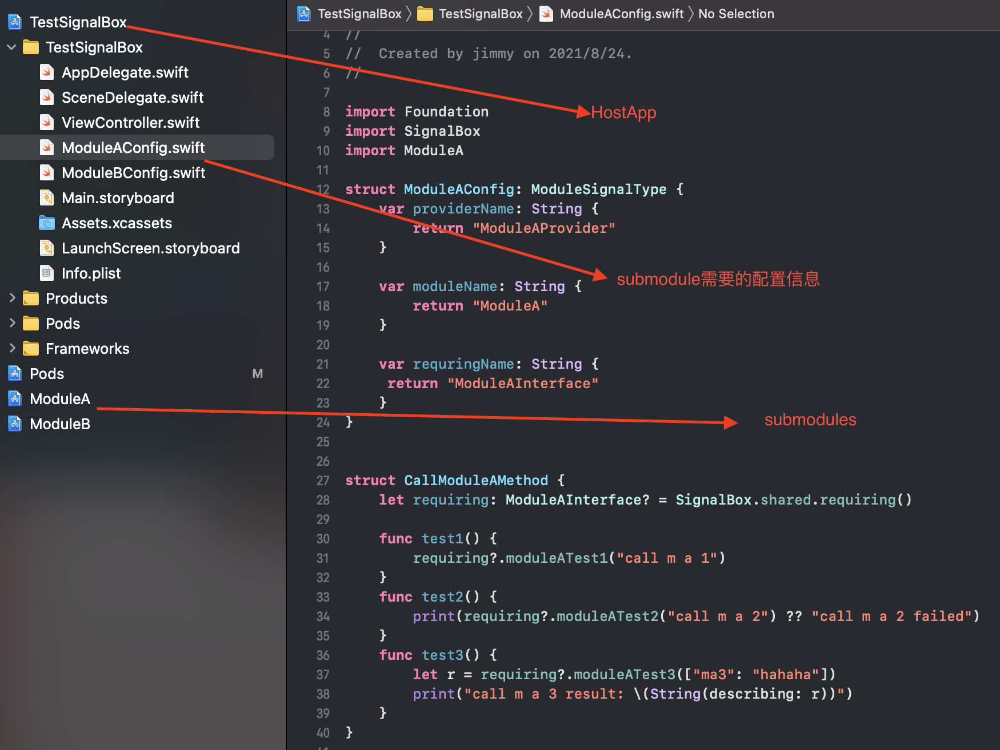
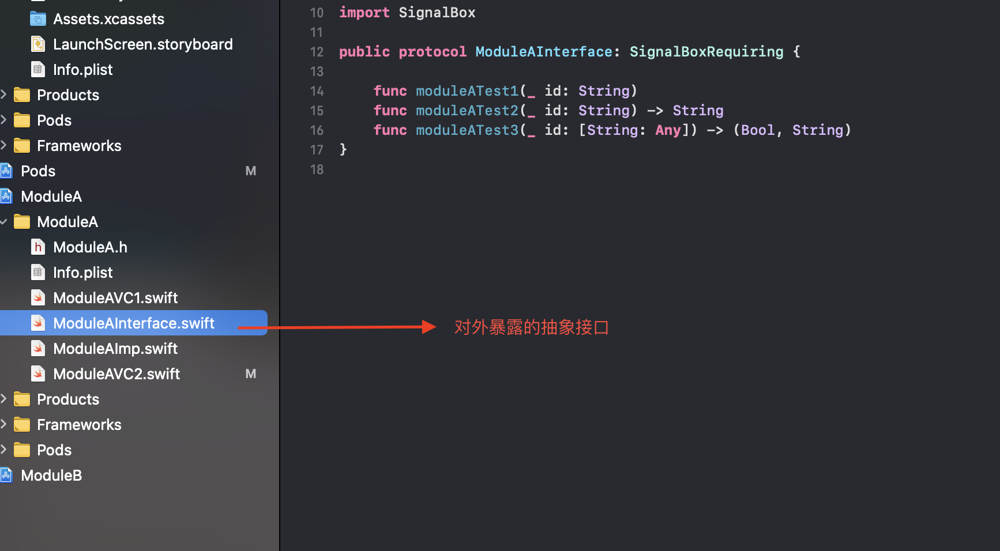
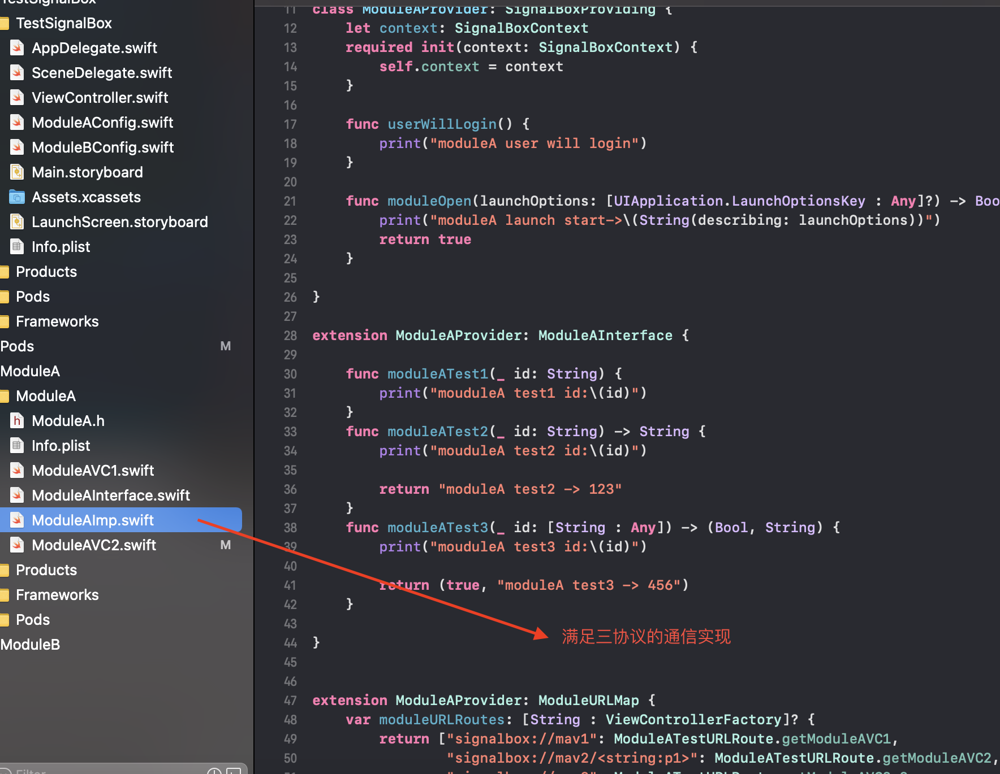

#### 测试SignalBox用

###### Sample：



###### SubModule对外的 配置：

> HostApp中或者有专门管理submodules配置的库，配置文件类似struct  ModuleAConfig 

```swift
struct ModuleAConfig: ModuleSignalType {
    var providerName: String {
        return "ModuleAProvider"
    }
    var moduleName: String {
        return "ModuleA"
    }
    var requringName: String {
     return "ModuleAInterface"
    }
}
```

> submodules对外暴露的方法的调用的管理

```swift
struct CallModuleAMethod {
    let requiring: ModuleAInterface? = SignalBox.shared.requiring()
    func test1() {
        requiring?.moduleATest1("call m a 1")
    }
    func test2() {
        print(requiring?.moduleATest2("call m a 2") ?? "call m a 2 failed")
    }
    func test3() {
        let r = requiring?.moduleATest3(["ma3": "hahaha"])
        print("call m a 3 result: \(String(describing: r))")
    }
}
```

###### SubModule自己的内部配置：





> 1. 对外暴露的接口实现类似ModuleAInterface
>
> 2. 真正通信用的ModuleAProvider
>
>    

```swift
class ModuleAProvider: SignalBoxProviding {
}
extension ModuleAProvider: ModuleAInterface {
}
extension ModuleAProvider: ModuleURLMap {
}

```

> 需要满足三个协议

#### 使用：

###### 在HostApp中:

```swift
//基于协议直接调用
SignalBox.shared.userWillLogin()
let callA = CallModuleAMethod() 
callA.test1()
//基于路由调用 (ViewController跳转用open, 不要直接用present和push)
SignalBox.shared.router.present("signalbox://mav1")
```

###### 在SubModule中调用其他SubModule：

```swift
//通过路由调用  handler为方法调用, open等式ViewController跳转
_ = SignalBox.shared.router.handler(url:"signalbox://moduleB.route1")
//支持block回调
let b = {
     print("call back to m a vc2  do to B")
 }
let r = SignalBox.shared.router.handler(url:"signalbox://moduleB.route4", context: b)
//支持返回结果
switch r {
    case .success(let v):              SignalBox.shared.router.present("signalbox://mbv2/\(v)")
     case .failed:
  print("to b failed")
}
```

#### 路由设置和匹配规则：

- 路由设置成 “signalbox://mav1”
  1. 不带参数的直接匹配“signalbox://mav1”
  2. 参数的话会匹配 “signalbox://mav1?p1=wwww”， (p1, wwww)会解析后存入QueryItem中
- 路由设置成“signalbox://mav2/\<string:p1\>”
  1. 带参数p1,p1是string类型,会匹配“signalbox://mav2/ttt”, ttt会被解析成p1
  2. 支持类型string，int, uint64, float, path

